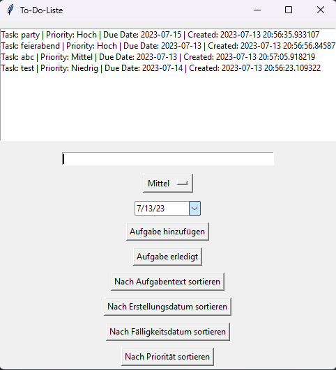

# Schritt 7: Backend-Logik und Algorithmen



## 7.2: Prioritäten, Fälligkeitsdaten und Optimierung

In diesem Schritt werden wir Prioritäten und Fälligkeitsdaten für die Aufgaben implementieren. Zusätzlich fügen wir Filterfunktionen hinzu, um Aufgaben basierend auf bestimmten Kriterien anzuzeigen. Wir optimieren auch die Such- und Löschvorgänge für eine schnellere Ausführung. Wir werden die Implementierungsdetails erläutern und die Auswirkungen auf die Benutzererfahrung und Leistung der To-Do-Liste diskutieren. Abschließend führen wir Tests durch, um sicherzustellen, dass die Optimierungen wie erwartet funktionieren.

### 1. Überprüfung des aktuellen Codes

Zu Beginn überprüfen wir den aktuellen Code. Wir haben bereits eine effiziente Datenstruktur in Form einer verketteten Liste implementiert und Sortierungsoptionen hinzugefügt. Nun werden wir Prioritäten und Fälligkeitsdaten für die Aufgaben implementieren.

### 2. Implementierung von Prioritäten und Fälligkeitsdaten

Um Prioritäten und Fälligkeitsdaten für die Aufgaben zu ermöglichen, werden wir einige Anpassungen am Code vornehmen.

- Zuerst importieren wir die erforderlichen Module für die Kalenderauswahl:

  ```python
  from tkcalendar import DateEntry


- Wir erweitern die `append`-Methode der verketteten Liste, um die Priorität und das Fälligkeitsdatum der Aufgabe zu akzeptieren:
  
  ```python
  def append(self, data):
      new_node = Node(data)
      if self.head is None:
          self.head = new_node
      else:
          current = self.head
          while current.next:
              current = current.next
          current.next = new_node

- Wir erweitern die Funktion `add_task`, um die Priorität und das Fälligkeitsdatum einzulesen und das Erstellungsdatum zur verketteten Liste hinzuzufügen:

  ```python
  def add_task():
    task = entry.get()
    priority = priority_var.get()
    due_date = date_var.get_date()
    if task:
        timestamp = datetime.datetime.now()
        todo_list.append((task, priority, due_date, timestamp))
        listbox.insert(tk.END, format_task_display(task, priority, due_date, timestamp))
        save_todo_list()
        entry.delete(0, tk.END)


### 3. Filterfunktionen für die Anzeige

Um Aufgaben basierend auf bestimmten Kriterien anzuzeigen, werden wir Filterfunktionen implementieren.

- Wir fügen die Funktionen `sort_tasks_by_due_date` und `sort_tasks_by_priority` hinzu, um die Aufgabenliste nach Fälligkeitsdatum und Priorität zu sortieren.

- Wir erweitern die Funktion `refresh_listbox`, um die formatierte Aufgabenanzeige mit Priorität und Fälligkeitsdatum in der Listbox anzuzeigen.

- Hier ist der aktualisierte Code für die Filterfunktionen und die Aktualisierung der Listbox:

- Filterfunktion nach Fälligkeitsdatum:

  ```python
  # Funktion zum Sortieren der Aufgaben nach Fälligkeitsdatum
  def sort_tasks_by_due_date():
      global todo_list
      sorted_list = sorted(todo_list, key=lambda x: x[2])
      todo_list = LinkedList()
      for task in sorted_list:
          todo_list.append(task)
      refresh_listbox()

- Filterfunktion nach Priorität:

  ```python
  # Funktion zum Sortieren der Aufgaben nach Priorität
  def sort_tasks_by_priority():
      global todo_list
      sorted_list = sorted(todo_list, key=lambda x: x[1])
      todo_list = LinkedList()
      for task in sorted_list:
          todo_list.append(task)
      refresh_listbox()

- Aktualisierte Funktion zum Aktualisieren der Listbox:

  ```python
  # Funktion zum Aktualisieren der Listbox
  def refresh_listbox():
    listbox.delete(0, tk.END)
    for task in todo_list:
        listbox.insert(tk.END, format_task_display(*task))


### 4. Anpassungen an die Benutzeroberfläche

Um die Priorität und das Fälligkeitsdatum in der Benutzeroberfläche anzuzeigen, werden wir das Dropdown-Menü für die Priorität und die Kalenderauswahl für das Fälligkeitsdatum hinzufügen.

- Wir erstellen ein Dropdown-Menü für die Priorität:

  ```python
  # Erstellen des Dropdown-Menüs für die Priorität
  priority_var = tk.StringVar(root)
  priority_var.set("Niedrig")
  priority_menu = tk.OptionMenu(root, priority_var, "Niedrig", "Mittel", "Hoch")
  priority_menu.pack(pady=5)


- Wir erstellen eine Kalenderauswahl für das Fälligkeitsdatum:
  
  ```python
  # Erstellen der Kalenderauswahl für das Fälligkeitsdatum
  date_var = DateEntry(root, width=12, background="darkblue", foreground="white", selectbackground="lightblue")
  date_var.pack(pady=5)

- Wir erstellen die Schaltfläche zum Sortieren nach Fälligkeitsdatum:

  ```python
  # Erstellen der Schaltfläche zum Sortieren nach Fälligkeitsdatum
  sort_due_date_button = tk.Button(root, text="Nach Fälligkeitsdatum sortieren", command=sort_tasks_by_due_date)
  sort_due_date_button.pack(pady=5)

- Wir erstellen die Schaltfläche zum Sortieren nach Priorität:

  ```python
  # Erstellen der Schaltfläche zum Sortieren nach Priorität
  sort_priority_button = tk.Button(root, text="Nach Priorität sortieren", command=sort_tasks_by_priority)
  sort_priority_button.pack(pady=5)

### 5. Tests und Optimierungen

Abschließend führen wir Tests durch, um sicherzustellen, dass die Optimierungen wie erwartet funktionieren. Wir testen das Hinzufügen von Aufgaben mit Priorität und Fälligkeitsdatum, die Sortierung nach verschiedenen Kriterien und die korrekte Anzeige der Priorität und des Fälligkeitsdatums, sowie des Erstellungsdatums in der Listbox.

Wir optimieren auch die Lösch- und Suchvorgänge, um eine schnellere Ausführung zu ermöglichen. Bei größeren Listen kann dies einen spürbaren Unterschied in der Leistung der To-Do-Liste bewirken.

### 6. Abschluss

Nachdem du diese Schritte durchgeführt hast, hast du erfolgreich Prioritäten und Fälligkeitsdaten für die Aufgaben implementiert. Du hast Filterfunktionen hinzugefügt, um Aufgaben basierend auf verschiedenen Kriterien anzuzeigen. Die Benutzererfahrung und Leistung der To-Do-Liste wurden verbessert. Vergiss nicht, Tests durchzuführen, um sicherzustellen, dass alles wie erwartet funktioniert.