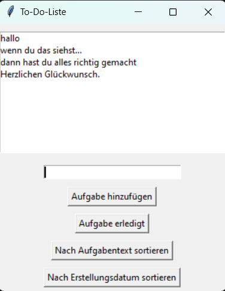

## Schritt 7: Backend-Logik und Algorithmen



### 7.1: Effiziente Datenstruktur und Sortierungsoptionen

In diesem Schritt werden wir die Backend-Logik und Algorithmen der To-Do-Liste verbessern, indem wir eine effiziente Datenstruktur implementieren und Sortierungsoptionen hinzufügen. Dadurch wird die Leistung und Benutzerfreundlichkeit der To-Do-Liste optimiert.

### 1. Überprüfung der aktuellen Implementierung

Zu Beginn sollten wir die aktuelle Implementierung der To-Do-Liste überprüfen. Der bisherige Code verwendet eine einfache Liste, um die Aufgaben zu speichern. Diese Implementierung erlaubt das Hinzufügen und Entfernen von Aufgaben, jedoch fehlt eine Sortiermöglichkeit.

### 2. Auswahl einer effizienten Datenstruktur

Um die Leistung der To-Do-Liste zu verbessern, verwenden wir eine effizientere Datenstruktur: die verkettete Liste. Eine verkettete Liste ermöglicht das Hinzufügen und Entfernen von Aufgaben in konstanter Zeit, während der Zugriff auf bestimmte Aufgaben etwas langsamer ist.

- Code für die Implementierung der verketteten Liste:

    ```python
    class Node:
        def __init__(self, data):
            self.data = data
            self.next = None

    class LinkedList:
        def __init__(self):
            self.head = None

        def append(self, data):
            new_node = Node(data)
            if self.head is None:
                self.head = new_node
            else:
                current = self.head
                while current.next:
                    current = current.next
                current.next = new_node

        # Funktion zum entfernen von Einträgen aus der To-Do-Liste
        def remove(self, index):
            if index == 0:
                self.head = self.head.next
            else:
                current = self.head
                prev = None
                count = 0
                while current and count != index:
                    prev = current
                    current = current.next
                    count += 1
                if current:
                    prev.next = current.next

        def __iter__(self):
            current = self.head
            while current:
                yield current.data
                current = current.next


### 3. Implementierung der neuen Datenstruktur

Wir nehmen die Implementierung der verketteten Liste in unserem Code vor. Dazu passen wir die Funktionen `load_todo_list`, `save_todo_list`, `add_task` und `mark_task_completed` entsprechend an, um die verkettete Liste zu nutzen. Beachte, dass die Funktionen `load_todo_list` und `save_todo_list` nun die Daten in der verketteten Liste speichern und laden müssen.

- Der aktualisierte Code für das Laden der To-Do-Liste:

    ```python
    # Laden der To-Do-Liste
    def load_todo_list():
        if os.path.exists("todo_list.pickle"):
            with open("todo_list.pickle", "rb") as file:
                return pickle.load(file)
        else:
            return LinkedList()

- Der aktualisierte Code für das Speichern der To-Do-Liste:

    ```python
    # Speichern der To-Do-Liste
    def save_todo_list():
        with open("todo_list.pickle", "wb") as file:
            pickle.dump(todo_list, file)

- Der aktualisierte Code für das Hinzufügen von Aufgaben zu der To-Do-Liste:

    ```python
    # Funktion zum Hinzufügen einer Aufgabe
    def add_task():
        task = entry.get()
        if task:
            todo_list.append((task, datetime.datetime.now()))
            listbox.insert(tk.END, task)
            save_todo_list()
            entry.delete(0, tk.END)

- Der aktualisierte Code für das erledigt Markieren von Aufgaben in der To-Do-Liste:

    ```python
    # Markieren einer Aufgabe als erledigt
    def mark_task_completed():
        selected_index = listbox.curselection()
        if selected_index:
            index = selected_index[0]
            current = todo_list.head
            count = 0
            while current and count != index:
                current = current.next
                count += 1
            if current:
                completed_task = current.data
                todo_list.remove(index)
                refresh_listbox()
                save_todo_list()
                print(f"Aufgabe '{completed_task[0]}' wurde als erledigt markiert und von der Liste entfernt.")
        else:
            print("Keine Aufgabe ausgewählt.")


### 4. Hinzufügen von Sortierungsoptionen

Wir fügen Sortierungsoptionen zur To-Do-Liste hinzu, um die Aufgaben nach verschiedenen Kriterien zu sortieren. In diesem Beispiel implementieren wir die Optionen "Nach Aufgabentext sortieren" und "Nach Erstellungsdatum sortieren".

- Code für die Sortierung nach Text:

    ```python
    # Funktion zum Sortieren der Aufgaben nach Aufgabentext
    def sort_tasks_by_text():
        global todo_list
        sorted_list = sorted(todo_list, key=lambda x: x[0].lower())
        todo_list = LinkedList()
        for task in sorted_list:
            todo_list.append(task)
        refresh_listbox()

- Code für die Sortierung der Aufgaben nach Erstellungsdatum:

    ```python
    # Funktion zum Sortieren der Aufgaben nach Erstellungsdatum
    def sort_tasks_by_date():
        global todo_list
        sorted_list = sorted(todo_list, key=lambda x: x[1])
        todo_list = LinkedList()
        for task in sorted_list:
            todo_list.append(task)
        refresh_listbox()

### 5. Aktualisieren der Liste

Um die neuen Sortierungsoptionen in richtig Aktualisieren zu können, fügen wir eine entsprechende Funktion hinzu.

- Code für die Aktualisierung der To-Do-Liste:

    ```python
    # Funktion zum Aktualisieren der Listbox
    def refresh_listbox():
        listbox.delete(0, tk.END)
        for task in todo_list:
            listbox.insert(tk.END, task[0])

### 6. Aktualisierung der GUI

Um die neuen Sortierungsoptionen in der GUI verfügbar zu machen, fügen wir entsprechende Schaltflächen hinzu.

- Hier ist der aktualisierte Code für die GUI:

    ```python
    # Erstellen der Schaltfläche zum Sortieren nach Aufgabentext
    sort_text_button = tk.Button(root, text="Nach Aufgabentext sortieren", command=sort_tasks_by_text)
    sort_text_button.pack(pady=5)

    # Erstellen der Schaltfläche zum Sortieren nach Erstellungsdatum
    sort_date_button = tk.Button(root, text="Nach Erstellungsdatum sortieren", command=sort_tasks_by_date)
    sort_date_button.pack(pady=5)


Die beiden Schaltflächen `sort_text_button` und `sort_date_button` werden erstellt und mit den entsprechenden Sortierungsfunktionen verknüpft.

Nachdem du diese Schritte durchgeführt hast, hast du erfolgreich die Backend-Logik und Algorithmen der To-Do-Liste verbessert. Du hast eine effiziente Datenstruktur implementiert und Sortierungsoptionen hinzugefügt, wodurch die Leistung der To-Do-Liste optimiert wurde.