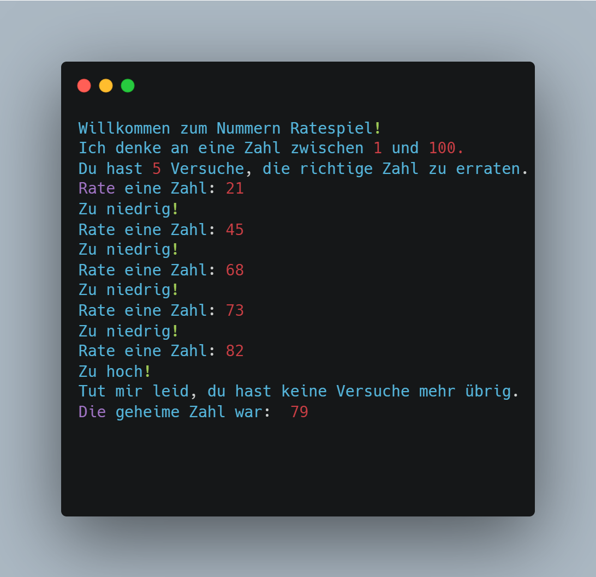

# Python-Tutorial für Einsteiger: Erstellen eines einfachen Spiels in 10 Schritten

Lernen Sie Python mit diesem einfachen Spiel-Tutorial in nur 10 Schritten!



## Einführung:

Python ist eine leicht zu erlernende Programmiersprache, die aufgrund ihrer Einfachheit und Vielseitigkeit weit verbreitet ist. In diesem Tutorial werde ich Sie durch die Erstellung eines einfachen Spiels mit Python führen. Am Ende dieses Tutorials werden Sie ein grundlegendes Verständnis von Python haben und bereit sein, seine endlosen Möglichkeiten zu erkunden.

## Spielübersicht und Zielsetzung:

Unser Spiel wird ein textbasiertes Ratespiel sein, bei dem der Spieler eine zufällig generierte Zahl innerhalb einer begrenzten Anzahl von Versuchen erraten muss. Lassen Sie uns Schritt für Schritt in die Erstellung dieses Spiels eintauchen.

### Schritt 1: Einrichten der Umgebung:

Um zu beginnen, müssen Sie Python auf Ihrem Rechner installiert haben. Gehen Sie auf die offizielle Python-Website (python.org) und laden Sie die neueste Version von Python herunter. Nach der Installation öffnen Sie einen Texteditor oder eine integrierte Entwicklungsumgebung (IDE) wie PyCharm oder Visual Studio Code, um Ihren Code zu schreiben.

### Schritt 2: Installieren Sie das erforderliche Modul:

Wir werden in diesem Spiel das Zufallsmodul verwenden. Es ist jedoch ein eingebautes Modul, das mit Python geliefert wird, so dass keine zusätzliche Installation erforderlich ist.

### Schritt 3: Erstellen Sie eine neue Python-Datei:

Öffnen Sie Ihren bevorzugten Texteditor oder IDE und erstellen Sie eine neue Datei. Speichern Sie sie mit der Erweiterung .py, zum Beispiel `guessing_game.py`. Dies wird die Datei sein, in die Sie Ihren Code schreiben.

### Schritt 4: Importieren der benötigten Module:

Python bietet integrierte Module, die importiert werden können, um uns bei verschiedenen Funktionen zu helfen. Wir beginnen mit dem Import des Zufallsmoduls, das es uns ermöglicht, eine Zufallszahl zu erzeugen, die der Spieler erraten muss.

```python
import random
```

### Schritt 5: Generierung einer Zufallszahl:

Mit Hilfe des Zufallsmoduls können wir eine Zufallszahl innerhalb eines bestimmten Bereichs erzeugen. Fordern Sie den Spieler auf, den gewünschten Bereich einzugeben und generieren Sie eine Zufallszahl innerhalb dieses Bereichs. Dies ist dann die Zahl, die der Spieler erraten muss.

```python
def play_game():
    print("Willkommen zum Nummern Ratespiel!")
    print("Ich denke an eine Zahl zwischen 1 und 100.")
    print("Du hast 5 Versuche, die richtige Zahl zu erraten.")

    geheime_Zahl = random.randint(1, 100)
    Versuche = 0
```

### Schritt 6: Implementierung der Hauptspielschleife:

Um dem Spieler mehrere Versuche zu ermöglichen, die Zahl zu erraten, erstellen Sie eine Schleife, die so lange läuft, bis der Spieler entweder die richtige Zahl errät oder die maximale Anzahl der Versuche ausgeschöpft ist. Fordern Sie den Spieler auf, eine Zahl einzugeben und sie mit der zufällig generierten Zahl zu vergleichen. Geben Sie geeignete Hinweise, um den Spieler näher oder weiter von der richtigen Antwort wegzuführen.

```python
while Versuche < 5:
    guess = int(input("Rate eine Zahl: "))
    attempts += 1

    if guess < geheime_Zahl:
        print("Zu niedrig!")
    elif guess > geheime_Zahl:
        print("Zu hoch!")
    else:
        print("Herzlichen Glückwunsch, Du hast die richtige Zahl erraten!")
        return
```

### Schritt 7: Hinzufügen der Logik für Gewinn-/Verlustbedingungen:

Verfolgen Sie innerhalb der Schleife die Anzahl der Versuche des Spielers. Wenn der Spieler die richtige Zahl innerhalb der erlaubten Versuche errät, wird eine Siegermeldung angezeigt und das Spiel beendet. Gelingt es dem Spieler nicht, die Zahl innerhalb der vorgegebenen Versuche zu erraten, wird eine Fehlermeldung ausgegeben und die richtige Antwort aufgedeckt.

```python
if Versuche == 5:
    print("Tut mir leid, du hast keine Versuche mehr übrig.")
    print("Die geheime Zahl war: ", geheime_Zahl)
```

### Schritt 8: Hinzufügen des Aufrufs für die play_game-Funktion:

Am Ende der Schleife rufen wir die Funktion "play_game" auf, um das Spiel zu starten.

```python
play_game()
```

### Schritt 9: Speichern und Ausführen des Spiels:

Speichern Sie die von Ihnen erstellte Datei mit der Erweiterung .py. Öffnen Sie ein Terminal oder eine Eingabeaufforderung, navigieren Sie zu dem Verzeichnis, in dem die Datei gespeichert ist, und starten Sie das Spiel, indem Sie den Befehl `python guessing_game.py` ausführen. Das Spiel wird gestartet, und Sie können durch Eingabe Ihrer Vermutungen mitspielen.

### Schritt 10: Testen und Verbessern:

Starten Sie das Spiel und testen Sie es selbst. Nehmen Sie notwendige Änderungen vor oder fügen Sie Ihre eigene kreative Note hinzu. Experimentieren Sie mit verschiedenen Schwierigkeitsgraden, die es den Spielern ermöglichen, zwischen einem breiteren oder engeren Zahlenbereich zu wählen.

## Fazit:

Herzlichen Glückwunsch! Sie haben erfolgreich ein einfaches textbasiertes Spiel mit Python erstellt. Dieses Tutorial hat Ihnen eine solide Grundlage in der Python-Programmierung vermittelt und Ihnen gleichzeitig die Freude gegeben, etwas Greifbares zu schaffen. Erforschen Sie weiterhin die umfangreiche Bibliothek von Python mit ihren Modulen und Funktionen, um Ihre Programmierkenntnisse zu erweitern und Ihrer Kreativität freien Lauf zu lassen.

Denken Sie daran: Übung macht den Meister. Nutzen Sie also die Gelegenheit, Ihre Kreation weiter zu verbessern, neue Funktionen hinzuzufügen oder sogar Ihre eigenen einzigartigen Spiele zu entwickeln, indem Sie Ihr erworbenes Wissen nutzen. Python bietet unendlich viele Möglichkeiten, und mit Engagement und Neugierde können Sie ein erfahrener Python-Entwickler werden. Viel Spaß beim Programmieren!
